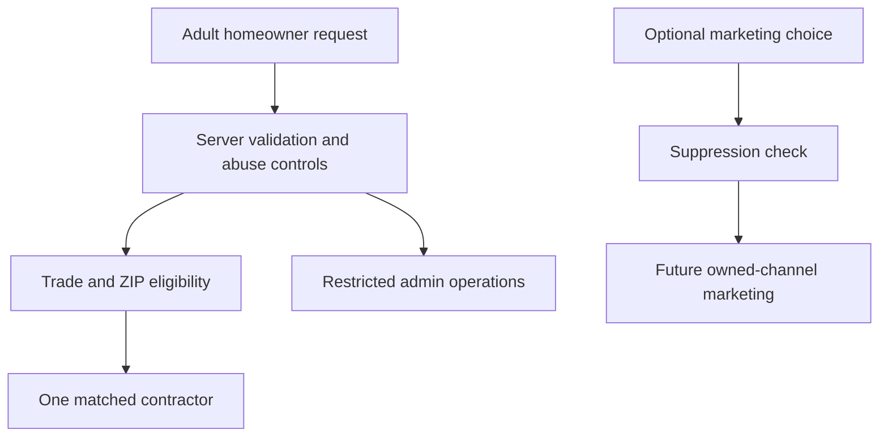

# Data Protection Assessment

Status: launch baseline  
Effective: September 9, 2026  
Review cadence: before a new data use, new recipient, targeted advertising, sale, significant
profiling, sensitive-data processing, or at least annually

## Scope and decision

Contractor Lead Engine accepts home-project requests throughout the United States and attempts to
route each request to one eligible contractor by trade and ZIP territory. The operator is based in
Kentucky, so Kentucky Consumer Data Protection Act response and appeal timelines are used as the
operational baseline for all users even when a particular statute does not apply because of state,
volume, or revenue thresholds.

The approved revenue model is contractor subscription, territory, platform, and matched-lead access.
Homeowner contact lists are not approved for data-broker sale, unrelated advertising, or broadcast to
multiple contractors.

## Data and purpose

| Data                                                       | Purpose                                           | Normal recipient                          | Required?                              |
| ---------------------------------------------------------- | ------------------------------------------------- | ----------------------------------------- | -------------------------------------- |
| Name, phone, email                                         | Validate and respond to a project request         | One matched contractor; authorized admins | Yes                                    |
| ZIP and requested service                                  | Territory and trade matching                      | One matched contractor; authorized admins | Yes                                    |
| Project description and timeline                           | Qualification and contractor response             | One matched contractor; authorized admins | Yes                                    |
| Budget                                                     | Project qualification                             | One matched contractor; authorized admins | No                                     |
| Consent version and timestamp                              | Prove the requested contact and marketing choices | Authorized admins                         | Yes                                    |
| Campaign tags and referrer hostname                        | Aggregate acquisition measurement                 | Authorized admins and service providers   | No                                     |
| Contractor business, credential, trade, and territory data | Account operation and eligibility controls        | Authorized admins                         | Mostly yes; credential number optional |
| Billing records                                            | Subscription operation, accounting, and disputes  | Authorized admins and payment provider    | When paid features are used            |

Users are instructed not to submit health data, financial account credentials, Social Security
numbers, or government-identification data. Homeowner intake requires an adult affirmation.

## Processing and sharing

Infrastructure and payment vendors may process limited data under their service terms. Adding an ad
network, enrichment vendor, data broker, or new downstream lead recipient requires a new assessment,
notice review, contract review, and opt-out integration before launch.

## Necessity and proportionality

Contact details and project information are necessary to provide the requested match. ZIP and trade
are the minimum practical routing inputs. Marketing consent is separate, optional, and off by
default. Attribution data is limited in length and should be reported in aggregate. One-recipient
routing reduces repeated solicitation and disclosure compared with auctioning a request to many
contractors.

## Material risks and safeguards

| Risk                                      | Current safeguard                                                              | Follow-up                                                      |
| ----------------------------------------- | ------------------------------------------------------------------------------ | -------------------------------------------------------------- |
| Unauthorized public database writes       | Anonymous table inserts revoked; intake runs server-side                       | Recheck database advisors after every migration                |
| Credential stuffing or account compromise | Managed authentication and role-based access                                   | Enable leaked-password protection before wider launch          |
| Spam or fraudulent requests               | Origin allowlist, honeypot, schema validation, payload cap, HMAC rate limiting | Add abuse monitoring and documented incident thresholds        |
| Excess contractor access                  | Database policies and one-contractor assignment                                | Periodically test cross-account access denial                  |
| Unlawful contractor behavior              | Signup compliance attestation and service terms                                | Add credential-review workflow for regulated trades/locations  |
| Marketing after opt-out                   | Durable suppression records; optional consent off by default                   | Every future email tool must check suppression before send     |
| Excess retention                          | Stated purpose-limited retention                                               | Approve a concrete deletion schedule before volume growth      |
| Privacy request delay                     | 45-day standard deadline, 60-day appeal deadline, admin queue                  | Add deadline alerts and identity-verification runbook          |
| Reidentification                          | Public commitment not to reidentify deidentified data                          | Restrict raw-data exports and document deidentification method |

## Consumer rights workflow

The public privacy form accepts access, correction, deletion, portable-copy, marketing opt-out,
sale opt-out, targeted-advertising opt-out, significant-profiling opt-out, appeal, and other requests.
The service verifies identity before disclosure, correction, or deletion. Standard requests receive a
45-day target; appeals receive a 60-day target. A denial must record a reason and provide appeal
instructions. A denied appeal must identify the appropriate state regulator complaint route.

Opt-out requests create durable, lowercase email suppression records immediately. Suppression records
are operational controls and must not be deleted merely because other profile or lead data is deleted.

## Retention and deletion

No final time-based retention schedule is approved yet. Until one is approved, access must remain
restricted and identifiable data may be kept only for matching, customer support, fraud prevention,
billing, dispute handling, security, or legal obligations. Before material scale, set and automate
retention periods by record category, including backups, logs, failed intake, leads, accounts,
privacy requests, billing, and suppressions.

## Automation gate

Marketing automation may be enabled only after all of the following are configured and tested:

1. Official legal business name and physical postal address.
2. A monitored sending and privacy/support email address on an authenticated domain.
3. Truthful sender identity and subject lines, ad identification where required, and a one-click or
   comparably clear unsubscribe path.
4. Suppression enforcement before every audience sync and send.
5. Vendor agreement, access review, send logs, consent evidence, and deletion/export workflow.
6. A documented owner for honoring opt-outs within the applicable deadline.

## Approval

This assessment supports the current one-contractor matching design. It does not approve selling
personal information, targeted advertising, significant profiling, sensitive-data processing, or
new automated outreach. Those uses require a new assessment and qualified legal review before
implementation.
